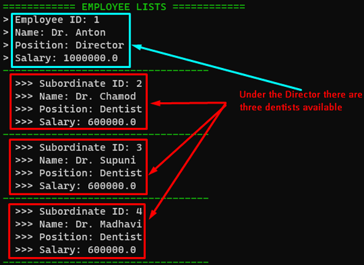
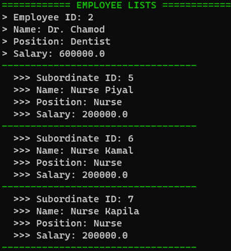

# Family Dental Care (FDC) Information System

## Project Overview

Family Dental Care (FDC) is a premier dental surgery, that provides comprehensive dental treatments. This project involves developing an information system to manage various tasks and interactions between staff and patients. The system is built using Object-Oriented Programming (OOP) principles and utilizes design patterns to structure and organize the code.

  

## Features

- **Patient Registration**: Capture and store personal details of new patients, including name, address, ID number, and contact information.
- **Doctor Registration**: Register dentists and consultants with their details and qualifications.
- **Appointment Management**: Schedule and manage patient appointments with available dentists.
- **Treatment Tracking**: Record and manage treatments provided to patients.
- **Payment Handling**: Track registration and treatment fees.
- **Room Management**: Allocate and track usage of surgery rooms and the dental scan room.
- **Staff Management**: Maintain information about the manager, nurses, and receptionist.

  

## Technologies Used

- **Language**: Java
- **Development Environment**: VS Code
- **Build Tool**: Terminal
- **Design Principles**: Object-Oriented Programming (OOP), Design Patterns

## Getting Started

1. Clone the repository: `git clone https://github.com/Nava-stack/family-dental-care-sytem.git`
2. Open the project in VS Code.
3. Build the project using the terminal commands specified in the repository.
4. Run the application and interact with the system as per the instructions provided.

## License

This project is licensed under the MIT License - see the [LICENSE](LICENSE) file for details.
